
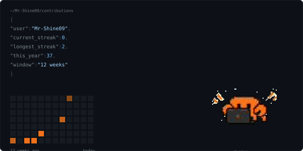

**4.0 GPA** · Honors Student · CIS Tutoring Assistant · VP, Competitive Programming Club

---

## Featured Builds

**VisionAssist** — Wearable Assistive Navigation Device · *Infineon collaboration* · Mar–Jun 2026

Head-mounted obstacle detection for visually impaired users, built with a 5-person team. Flask MJPEG live-feed pipeline with real-time TTS alerts, running YOLOv8n on-device at ~3–5 FPS on a Raspberry Pi 5 with an Arducam V3.

Evaluated Infineon's XENSIV 60GHz radar for depth, determined it wouldn't ship inside the project window, and designed a monocular geometry-based distance estimator in its place — which is what carried the final demo to Infineon engineers.

`Python` `Flask` `YOLOv8` `OpenCV` `Raspberry Pi`

---

**Lookout** — AI-Agent Event Discovery · UC Berkeley AI Hackathon · Jun 2026

Solo 24-hour build. A watcher that monitors the live web for opportunities described in plain English, then runs a five-agent pipeline to act on a match rather than just alerting: Scout → Fit Judge → Strategist → Drafter → Critic.

The fit judge's relevance model retrains during the session on live thumbs up/down, so the ranking visibly re-sorts as it learns. Redis holds vector memory for new/seen/changed dedup, Browserbase drives the scout's live-web reads, and Sentry covers backend failures.

`Claude API` `Browserbase` `Redis` `Sentry`

---

[**Huffman-Encoding-Algorithm**](https://github.com/Mr-Shine09/Huffman-Encoding-Algorithm) — C++ honors project implementing the full compression path across a Hash Table, Sorted Linked List, and Binary Tree, with an interactive web demo.

`C++` `STL`

---

## Also working with

`Java` `JavaScript` `FastAPI` `Jinja2` `NumPy` `Pandas` `Scikit-Learn` `Git` `Uvicorn` `g++` `Clang`

---

