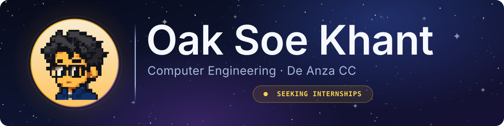

  &nbsp;&nbsp;&nbsp;
  &nbsp;&nbsp;&nbsp;
  &nbsp;&nbsp;&nbsp;
  &nbsp;&nbsp;&nbsp;
  &nbsp;&nbsp;&nbsp;
  

**4.0 GPA** · Honors Student · CIS Tutoring Assistant · VP, Competitive Programming Club

---

🤖&nbsp;&nbsp;AI technology fanatic, passionate about building assistive technologies and productivity-boosting tools.&nbsp;&nbsp;🦾

---

## Hardware

### 01 / [VisionAssist](https://github.com/Mr-Shine09/VisionAssist)

**The problem:** Navigation aids for blind users assume a phone, a data plan, and a cloud
endpoint. All three fail exactly when someone is outdoors and alone.

**The solution:** A head-mounted device that identifies obstacles and speaks them aloud —
*"stop, chair, 2 steps ahead"* — entirely on-device. YOLOv8n runs at ~5 FPS on a Raspberry Pi 5
with an Arducam IMX708, and audio goes out over Bluetooth earbuds. No phone, no cloud, no
internet. Built over six weeks by a five-person team at De Anza as an Infineon-sponsored
capstone and demoed to their engineers.

I evaluated Infineon's XENSIV 60 GHz radar for depth, determined it would not ship inside the
project window, and designed the monocular bounding-box distance estimator that replaced it —
which is what carried the final demo.

  <strong>Stack</strong>&nbsp;&nbsp;
  &nbsp;
  &nbsp;
  &nbsp;
  &nbsp;
  

---

## Software

### 02 / [PokeDesk](https://github.com/Mr-Shine09/PokeDesk)

**The problem:** When a coding agent is working, you either sit and watch a terminal or you walk
away and lose track of whether it finished, stalled, or failed.

**The solution:** A pixel mascot that lives at the bottom edge of your Mac and shows agent state
at a glance — it sits down and types while Claude Code or Codex works, fist-pumps on success,
goes dizzy on failure, and curls up to sleep after 23:00. A native AppKit menu-bar accessory
that never activates over your work and **never reads a single character** of your prompts,
code, or terminal output; it reads hook events only. I measured the idle-CPU budget rather than
guessing at it, and published the failed measurement alongside the passing one.

  <strong>Stack</strong>&nbsp;&nbsp;
  &nbsp;
  &nbsp;
  &nbsp;
  

---

### 03 / [Zephyr](https://github.com/Mr-Shine09/Zephyr)

**The problem:** You give an agent a real job — a migration, a refactor, a test suite to green —
and then you are chained to the keyboard for forty minutes in case it stops to ask you something.

**The solution:** Zephyr streams a live Mistral Vibe session to your phone and lets you answer
it from there. It adds `pre_agent` and `agent_waiting` observer hooks so a desktop companion can
tell the difference between *working* and *blocked on you*, then hands you the approval prompt
wherever you are. macOS mascot plus an iOS companion app, sharing one event bridge. Built for
the Mistral Vibe Hackathon, Track 02.

  <strong>Stack</strong>&nbsp;&nbsp;
  &nbsp;
  &nbsp;
  &nbsp;
  

---

### 04 / [Look-Out](https://github.com/Mr-Shine09/Look-Out)

**The problem:** Every alert tool ever built — Google Alerts, RSS, saved searches — is designed
to notify you *more*. They re-fire on every duplicate and every reword, so you mute them, and
then you miss the one that mattered.

**The solution:** Look-Out is a suppression engine. Before anything reaches you it asks two
questions: *have I effectively shown you this already?* (semantic dedup against alert history in
Redis vector search) and *does this actually matter to you?* (an LLM judging against a spec
compiled from your plain-English ask). Only items clearing both bars surface. The longer it
runs, the quieter it gets. On a match it runs a five-stage pipeline — Scout → Fit Judge →
Strategist → Drafter → Critic — to draft a response for your approval, and your thumbs up/down
retrains the relevance threshold live, so the ranking visibly re-sorts during a session.

Built at the UC Berkeley AI Hackathon 2026. **Lead author — 27 of the 52 commits**, across a
five-person team; I built the judge, the dedup memory, and the agent pipeline.

  <strong>Stack</strong>&nbsp;&nbsp;
  &nbsp;
  &nbsp;
  &nbsp;
  &nbsp;
  

---

### 05 / [Huffman Encoding Algorithm](https://github.com/Mr-Shine09/Huffman-Encoding-Algorithm) · [Live demo](https://mr-shine09.github.io/Huffman-Encoding-Algorithm/)

**The problem:** Huffman coding is taught as a diagram on a whiteboard, which hides the fact
that it is really three different data structures handing work to each other.

**The solution:** A full C++ implementation where each stage owns exactly one structure — a
direct-address **hash table** counts frequencies in O(1), a **sorted linked list** keeps leaves
ordered by frequency, and a **binary tree** merges them greedily into prefix-free codes.
Composition and pointers throughout, no inheritance. The browser demo builds the frequency
table, tree, codes, and live compression ratio as you type. CIS 22C Honors project.

  <strong>Stack</strong>&nbsp;&nbsp;
  &nbsp;
  &nbsp;
  

---

## Also working with

  &nbsp;
  &nbsp;
  &nbsp;
  &nbsp;
  &nbsp;
  &nbsp;
  &nbsp;
  &nbsp;
  

